# Simple DDPM by PyTorch

A clean, minimalist implementation of **DDPM (Denoising Diffusion Probabilistic Models)** in PyTorch, designed to demonstrate the core concepts of diffusion-based generative modeling with clarity and simplicity.

---

## Quickstart
1. Clone the repo:

```bash
git clone https://github.com/skacelviktor/Simple-DDPM-by-PyTorch
cd Simple-DDPM-by-PyTorch
```

2. Install dependencies:

```bash
pip install -r requirements.txt
```

3. Run the code:

- Open `train.ipynb` or `GenerateImage.ipynb` in Jupyter Notebook or VS Code. 
- Run the cells to train the model or generate images.
- You can also try the provided pretrained model to generate handwritten digits. The model is located in `Save_model/model_DDPM.pth`.

## Project Structure

| File | Purpose |
|------|---------|
| `model.py` | U-Net architecture for noise prediction |
| `Noise.py` | Diffusion process (noise scheduler) |
| `DatasetLoader.py` | Image loading and preprocessing |
| `train.ipynb` | **Run this to train** the model |
| `GenerateImage.ipynb` | **Run this to generate** images |
| `requirements.txt` | Package dependencies |

**Directories created during training:**
- `save_model/` - Model checkpoints saved here
- `generated_imgs/` - Generated images saved here

## How It Works
Diffusion models work in three stages:

### 1. Forward process ($q$)
- We gradually add noise to an image $x_0$ over $T$ steps using a fixed variance schedule $\beta_t$.

```math
q(x_t \mid x_{t-1}) = \mathcal{N}\left(
x_t;\; \sqrt{1 - \beta_t}\, x_{t-1},\; \beta_t I
\right)
```

- We can compute Gaussian noise for specific timestep $t$.

```math
x_t = \sqrt{\bar{\alpha}_t}\, x_0 + \sqrt{1 - \bar{\alpha}_t}\, \epsilon
```

- Here, $x_0$ is the original clean image, $\epsilon \sim \mathcal{N}(0, I)$ is Gaussian noise, 
and $\bar{\alpha}_t$ represents the cumulative noise scaling.

```math
\bar{\alpha}_t = \prod_{i=1}^{t} (1 - \beta_i)
```

### 2. Training: The model learns to predict the noise added at each timestep
- Generate Gaussian noise for the image.
- Add this noise to the clean image $x_0$ to obtain $x_t$.
- The model is trained to predict the added noise $\epsilon$ from $x_t$.
- Mean Squared Error (MSE) is used as the training loss.

### 3. Reverse Process: Generating a clean image from pure noise

- Start from pure Gaussian noise $x_T$ 
- At each timestep $t$, the model predicts the noise $\epsilon_\theta(x_t, t)$ in the current image  
- Instead of directly removing the predicted noise, we compute the mean $\mu(x_t, t)$ of the posterior distribution:

```math
\mu(x_t, t) = \frac{1}{\sqrt{\alpha_t}} \left( x_t - \frac{\beta_t}{\sqrt{1 - \alpha_{t-1}}} \epsilon_\theta(x_t, t) \right)
```

- Gaussian noise with variance $\sigma_t^2$ is added to stabilize sampling:

```math
\sigma_t^2 = \frac{1 - \bar{\alpha}_{t-1}}{1 - \bar{\alpha}_t} \, \beta_t
```

- This process is repeated for $T$ timesteps (e.g., 1000) until a clean image $x_0$ is generated

## Model Architecture

To predict noise, a symmetric encoder-decoder **U-Net** with **Time Embedding** is implemented.  
The model consists of the following components:

1. **Time Embedding**
    - Converts a timestep \(t\) into an n-dimensional vector
    - Uses sinusoidal positional encoding followed by two fully connected layers with **SiLU** activations
    - Provides temporal context to the ResBlocks

2. **Residual Block (ResBlock)**
    - Two convolutional layers with a skip connection
    - Conditioned on the timestep embedding
    - Architecture:
        - `Conv2d (3x3) → SiLU`
        - Feedforward time embedding through `SiLU → Linear` layer
        - Add transformed time embedding
        - `SiLU → Conv2d (3x3)`
        - Optional `Conv2d (1x1)` if input/output channels differ
        - Add residual connection

3. **Downsampling Block (Encoder)**
    - Processes features with a ResBlock
    - Reduces spatial dimensions by a factor of 2 using `MaxPool2d`
    - Skip connections are stored for the decoder

4. **Bottleneck**
    - Processes features with a single ResBlock

5. **Upsampling Block (Decoder)**
    - Upsamples features using `ConvTranspose2d`
    - Concatenates skip connections from the encoder
    - Processes concatenated features with a ResBlock

### U-Net Forward Pass
- Generate time embedding for timestep \(t\)
- Pass input through the encoder, storing skip connections
- Process through the bottleneck
- Upsample through the decoder, concatenating corresponding skips
- Final `Conv2d` layer outputs the predicted noise

## Results
Using this simple model, we were able to train it to generate images of handwritten digits.  
The [**MNIST Dataset**](https://www.kaggle.com/datasets/hojjatk/mnist-dataset) was used for training. After 100 epochs, the model generated the following images:

<table>
<tr>
  <td>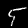</td>
  <td></td>
  <td>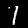</td>
  <td>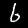</td>
  <td>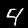</td>
</tr>
<tr>
  <td>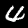</td>
  <td></td>
  <td>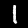</td>
  <td>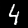</td>
  <td>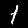</td>
</tr>
<tr>
  <td>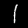</td>
  <td>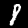</td>
  <td>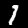</td>
  <td>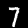</td>
  <td>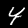</td>
</tr>
<tr>
  <td>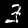</td>
  <td>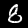</td>
  <td>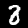</td>
  <td>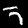</td>
  <td>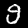</td>
</tr>
<tr>
  <td>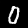</td>
  <td></td>
  <td>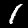</td>
  <td></td>
  <td>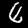</td>
</tr>
</table>

This is not perfect, but with a larger model and more computing power, the same approach can generate, for example, realistic face images.  
On my computer, I trained a model capable of generating some face images; the rest of the code is identical:

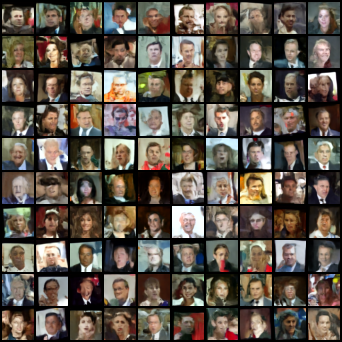 

## How to Train Your Own DDPM

This section explains how to train a simple **Denoising Diffusion Probabilistic Model (DDPM)** on your own dataset using the provided code.

### 1. Download Your Dataset
- Prepare and download your image dataset. Supported file formats include `.png`, `.jpg` and `.jpeg`.
- Smaller variations between images make it easier for the model to predict noise effectively.

### 2. Setup the Code
- Set the image size for your dataset:

```python
image_size = 28
```

- Load your dataset by specifying the path to your images:

```python
data = ImageDataset("Path/to/images", image_size=image_size)
```

- Initialize the U-Net model.
    - For grayscale images: in_channels = 1
    - For color images: in_channels = 3 (requires more computing power)

```python
model = U_net(device, in_channels=1)
```

### 3. Generate Images
- Make sure the generation setup matches the training configuration (image size, number of channels, timesteps...).
- Load the trained model weights.

```python
model_path = os.path.join("Save_model", "model_DDPM.pth")
model.load_state_dict(torch.load(model_path, map_location=device))
```

### 4. Tips for Better Results
- Increase the number of training epochs:

```python
num_epochs = 100
```

- Increase the dimensionality of the time embedding:

```python
model = U_net(device, in_channels=1, t_dim=256)
```

- You can upgrade the U-Net architecture to a more complex version. Larger models and longer training generally lead to higher-quality generated images.

## License
This project is licensed under the **MIT License** — see the `LICENSE` file for details.

---

**Author:** Skácel Viktor
